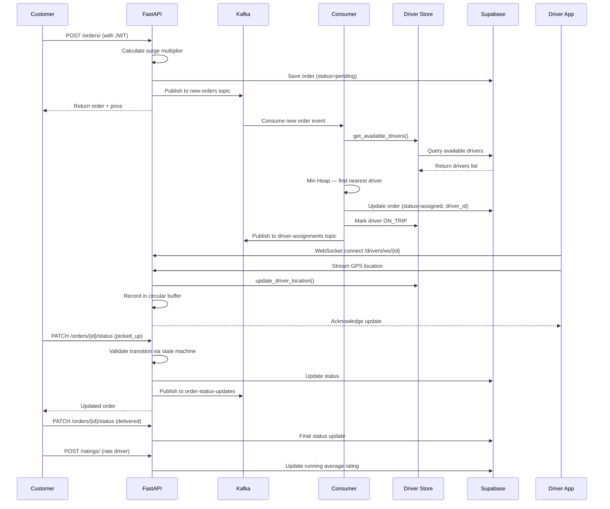
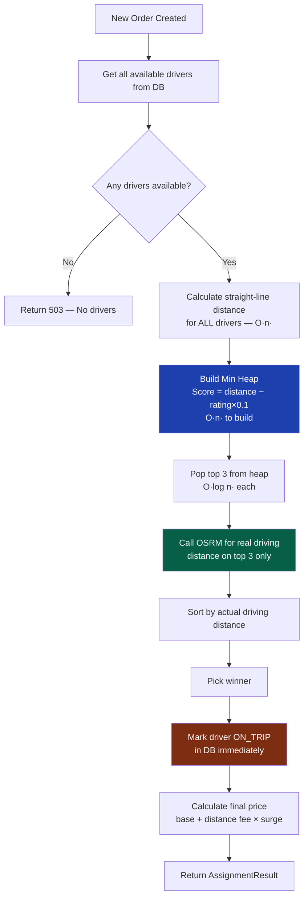
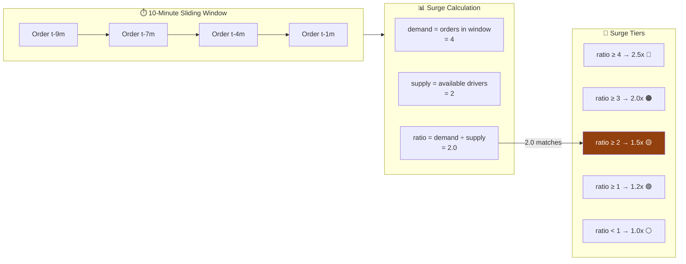
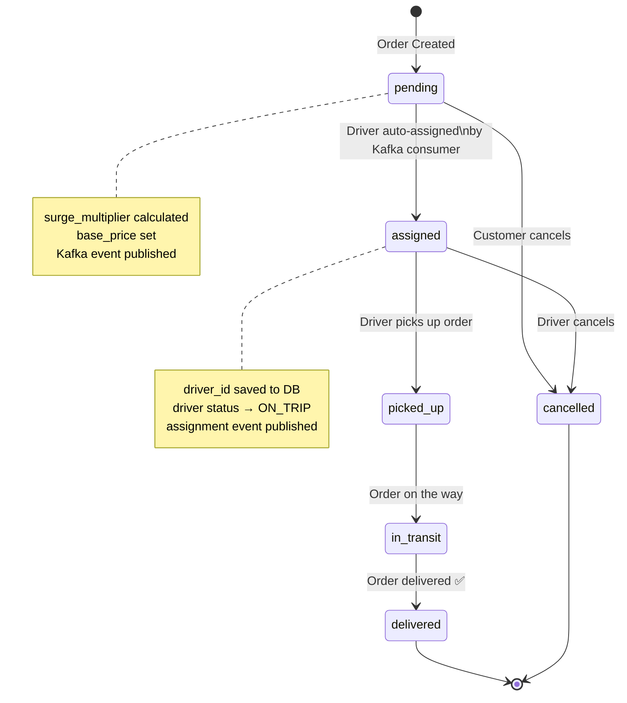
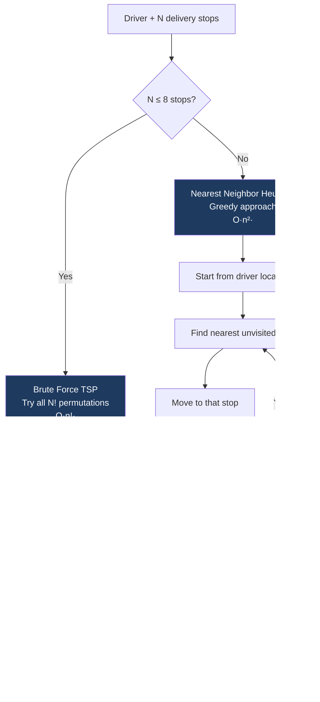
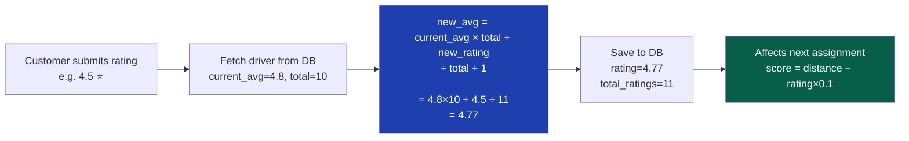
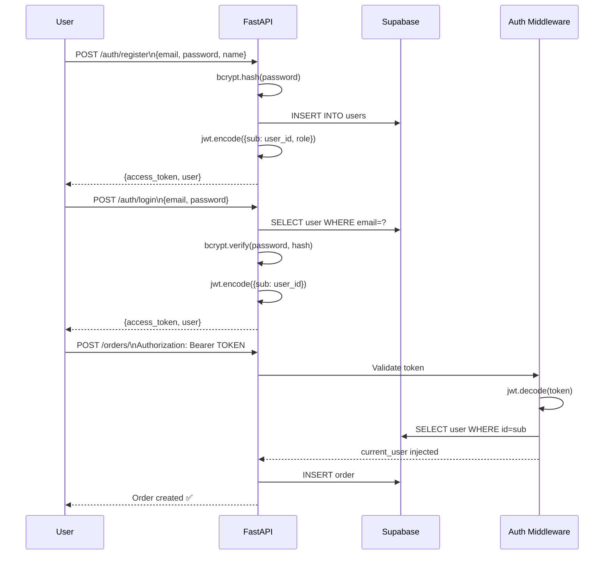
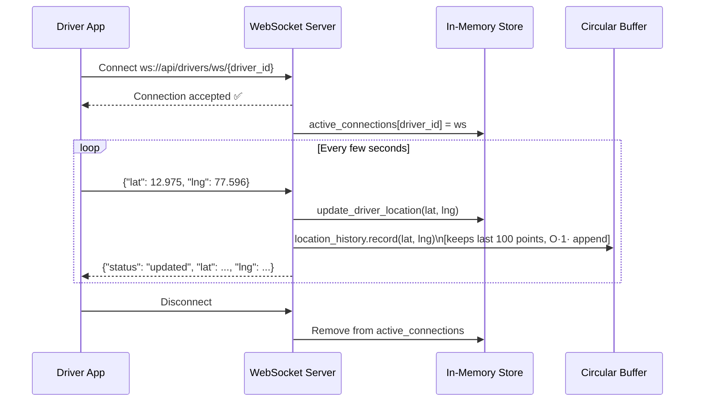
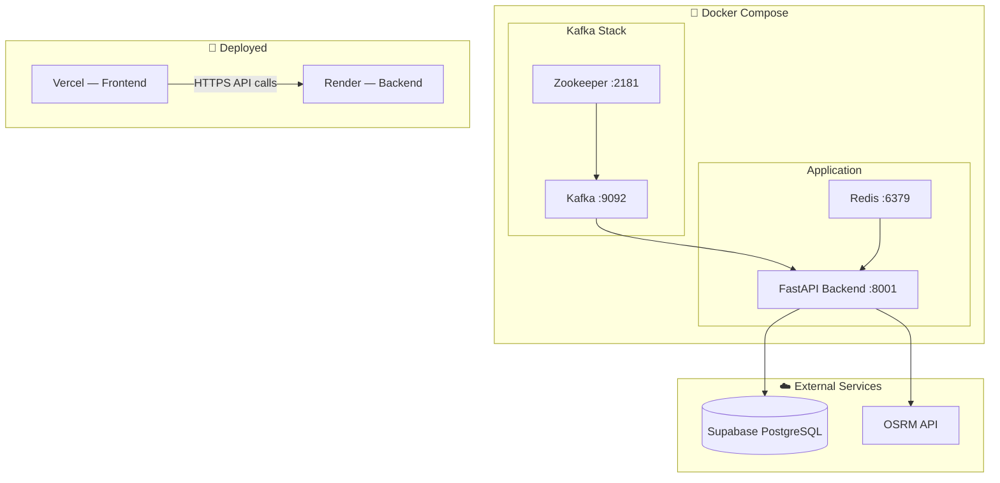

# 🚀 Delivery Routing System

A production-grade delivery routing backend inspired by Swiggy/Zomato — built with FastAPI, Kafka, Supabase, and Next.js. Features real-time driver assignment, surge pricing, route optimization, and JWT authentication.

---

## 📦 Tech Stack

| Layer | Technology |
|-------|-----------|
| Backend | FastAPI (Python) |
| Message Queue | Apache Kafka |
| Database | Supabase (PostgreSQL) |
| ORM | SQLAlchemy |
| Routing | OSRM (Open Source Routing Machine) |
| Real-time | WebSockets |
| Auth | JWT (python-jose + bcrypt) |
| Frontend | Next.js + Tailwind CSS |
| Maps | Leaflet.js + OpenStreetMap |
| Containerization | Docker + Docker Compose |

---

## 🗂️ Project Structure

```
Martensite/
├── backend/
│   ├── consumers/
│   │   └── order_consumer.py       # Kafka consumer — auto-assigns drivers
│   ├── middleware/
│   │   └── auth_middleware.py      # JWT token validation
│   ├── models/
│   │   ├── driver.py               # SQLAlchemy ORM + Pydantic schemas
│   │   ├── order.py                # Order model with surge pricing
│   │   └── user.py                 # User model for auth
│   ├── routers/
│   │   ├── auth.py                 # /auth/register, /auth/login
│   │   ├── drivers.py              # Driver CRUD + assignment
│   │   ├── orders.py               # Order management
│   │   ├── ratings.py              # Driver rating system
│   │   └── routes.py               # Route optimization + surge
│   ├── schemas/
│   │   └── order.py                # Pydantic request/response shapes
│   ├── services/
│   │   ├── assignment.py           # Min Heap driver assignment
│   │   ├── auth_service.py         # JWT creation + verification
│   │   ├── distance.py             # OSRM + Haversine distance
│   │   ├── driver_store.py         # DB queries for drivers
│   │   ├── kafka_producer.py       # Kafka event publishers
│   │   ├── location_history.py     # Circular buffer for GPS history
│   │   ├── order_service.py        # Order status state machine
│   │   ├── rating_service.py       # Running average ratings
│   │   ├── route_optimizer.py      # TSP route optimization
│   │   └── surge_service.py        # Sliding window surge pricing
│   ├── db.py                       # SQLAlchemy engine + session
│   ├── init_db.py                  # Table creation script
│   ├── main.py                     # FastAPI app + WebSocket
│   ├── Dockerfile
│   └── requirements.txt
├── frontend/
│   ├── app/
│   │   ├── page.tsx                # Landing page
│   │   ├── login/page.tsx          # Auth page
│   │   └── dashboard/page.tsx      # Live dashboard
│   ├── components/
│   │   ├── Map.tsx                 # Leaflet driver map
│   │   ├── OrderBoard.tsx          # Live order list
│   │   ├── DriverList.tsx          # Driver status board
│   │   └── SurgeIndicator.tsx      # Surge multiplier display
│   └── lib/
│       └── api.ts                  # Axios API client
└── docker-compose.yml
```

---

## 🔄 System Architecture

```mermaid
graph TB
    subgraph Client["🖥️ Client Layer"]
        FE[Next.js Dashboard]
        WS_CLIENT[WebSocket Client]
    end

    subgraph API["⚡ API Layer - FastAPI"]
        AUTH[/auth]
        ORDERS[/orders]
        DRIVERS[/drivers]
        RATINGS[/ratings]
        ROUTES[/routes]
        WS[WebSocket /drivers/ws]
    end

    subgraph Queue["📨 Message Queue - Kafka"]
        T1[new-orders topic]
        T2[driver-assignments topic]
        T3[order-status-updates topic]
    end

    subgraph Services["🔧 Services Layer"]
        ASSIGN[Assignment Service]
        SURGE[Surge Calculator]
        STATE[State Machine]
        OPTIMIZER[Route Optimizer]
        HISTORY[Location History]
    end

    subgraph DB["🗄️ Data Layer"]
        SUPABASE[(Supabase PostgreSQL)]
        MEMORY[In-Memory Store]
    end

    subgraph External["🌐 External APIs"]
        OSRM[OSRM Routing API]
    end

    FE -->|HTTP + JWT| AUTH
    FE -->|HTTP + JWT| ORDERS
    FE -->|HTTP| DRIVERS
    FE -->|HTTP| RATINGS
    FE -->|HTTP| ROUTES
    WS_CLIENT -->|WebSocket| WS

    ORDERS -->|publish| T1
    T1 -->|consume| ASSIGN
    ASSIGN -->|publish| T2
    STATE -->|publish| T3

    ASSIGN -->|driving distance| OSRM
    ASSIGN --> SURGE
    DRIVERS --> MEMORY
    ORDERS --> SUPABASE
    AUTH --> SUPABASE
    WS --> HISTORY
    WS --> MEMORY
```

---

## 🚦 Order Lifecycle Flow



---

## 🧠 Driver Assignment Algorithm



---

## 💰 Surge Pricing — Sliding Window



---

## 📊 Order State Machine — Directed Graph



---

## 🗺️ Route Optimization — TSP



---

## ⭐ Driver Rating System — Running Average



---

## 🔐 JWT Authentication Flow



---

## 📡 WebSocket Real-Time Location



---

## 🐳 Docker Architecture



---

## 🛠️ Data Structures Used

| Feature | Data Structure | Why |
|---------|---------------|-----|
| Driver Assignment | **Min Heap** | O(log n) nearest driver lookup |
| Order Status | **Directed Graph** | Enforces valid state transitions |
| Surge Pricing | **Sliding Window (deque)** | O(1) add/remove, tracks last 10 mins |
| Location History | **Circular Buffer (deque maxlen)** | O(1) append, auto-evicts old data |
| Route Optimization | **TSP / Nearest Neighbor** | Finds shortest multi-stop path |
| Rating System | **Running Average** | No need to store all ratings |
| Active WebSockets | **Hash Map** | O(1) driver lookup by ID |

---

## 🚀 Getting Started

### Prerequisites
- Python 3.13+
- Node.js 18+
- Docker + Docker Compose
- Supabase account

### Backend Setup
```bash
cd backend
python -m venv venv
source venv/bin/activate
pip install -r requirements.txt

# Create .env
cp .env.example .env
# Fill in DATABASE_URL, SECRET_KEY, KAFKA_BOOTSTRAP_SERVERS

# Create tables
python init_db.py

# Run
uvicorn main:app --reload --port 8001
```

### Frontend Setup
```bash
cd frontend
npm install
cp .env.local.example .env.local
# Set NEXT_PUBLIC_API_URL=http://localhost:8001
npm run dev
```

### Docker (Full Stack)
```bash
docker-compose up --build
```

---

## 📋 API Reference

| Method | Endpoint | Auth | Description |
|--------|----------|------|-------------|
| POST | `/auth/register` | ❌ | Register new user |
| POST | `/auth/login` | ❌ | Login, get JWT |
| POST | `/orders/` | ✅ | Create order |
| GET | `/orders/` | ✅ | List all orders |
| PATCH | `/orders/{id}/status` | ✅ | Update order status |
| POST | `/drivers/register` | ❌ | Register driver |
| POST | `/drivers/assign` | ❌ | Assign nearest driver |
| GET | `/drivers/` | ❌ | List all drivers |
| POST | `/ratings/` | ❌ | Rate a driver |
| GET | `/ratings/top-drivers` | ❌ | Top rated drivers |
| POST | `/routes/optimize` | ❌ | Multi-stop route |
| POST | `/routes/surge` | ❌ | Get surge multiplier |
| WS | `/drivers/ws/{id}` | ❌ | Real-time location |

Full interactive docs: `http://localhost:8001/docs`

---

## 🌐 Deployment

| Service | Platform | URL |
|---------|----------|-----|
| Backend API | Render | `https://your-app.onrender.com` |
| Frontend | Vercel | `https://your-app.vercel.app` |
| Database | Supabase | Managed PostgreSQL |

---

## 📈 Performance Characteristics

```
Driver Assignment:
  - Straight-line ranking: O(n log n) sorting → O(n) heap build
  - OSRM calls: Only top 3 candidates (not all n drivers)
  - Result: Scales to 100,000+ drivers efficiently

Surge Pricing:
  - Sliding window cleanup: O(k) where k = expired events
  - Zone lookup: O(1) hash map
  - Result: Handles thousands of concurrent zones

Route Optimization:
  - Brute force (n ≤ 8): O(n!) — max 8! = 40,320 operations
  - Nearest neighbor (n > 8): O(n²)
  - Result: Fast for real-world delivery batch sizes
```

---

## 🧪 Testing

```bash
# Health check
curl http://localhost:8001/health

# Register + login
curl -X POST http://localhost:8001/auth/register \
  -H "Content-Type: application/json" \
  -d '{"email":"test@test.com","name":"Test","password":"secret123"}'

# WebSocket test
python test_ws.py
```

---

## 👨‍💻 Built By

Raj Aryan — [@rajaryan](https://github.com/rajaryan)

Inspired by the engineering systems behind Swiggy, Zomato, and Uber Eats.