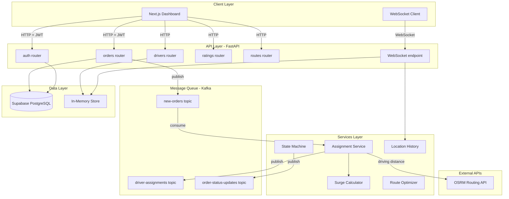
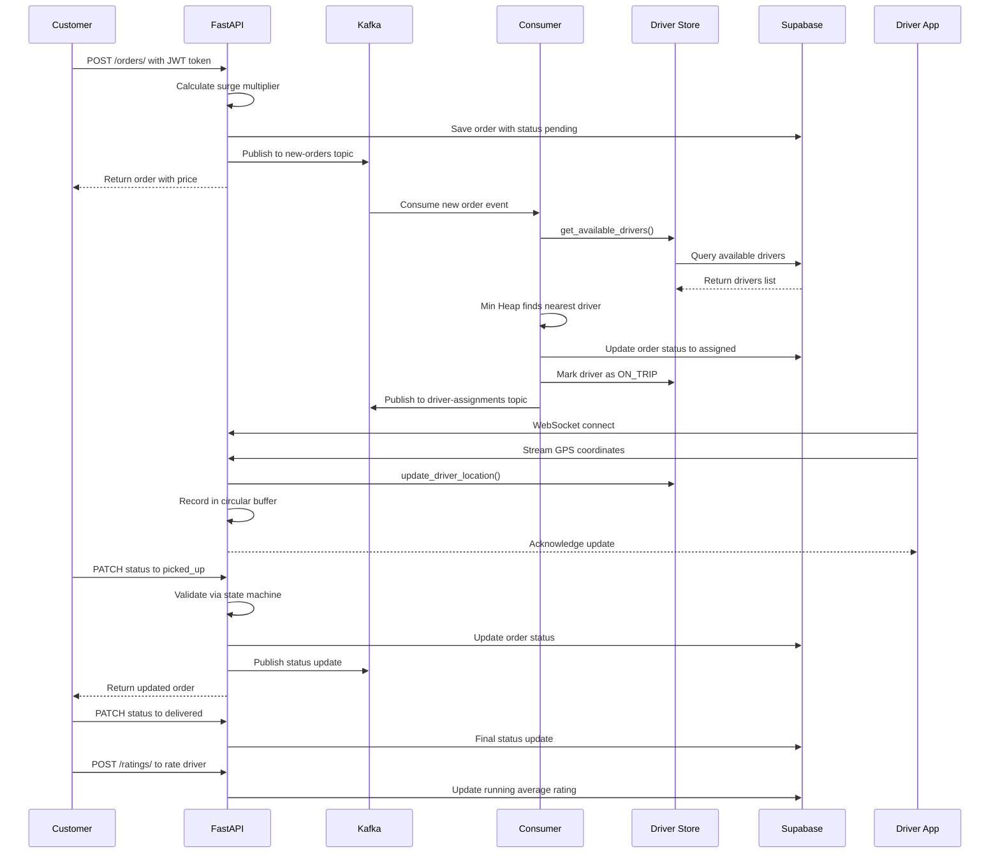
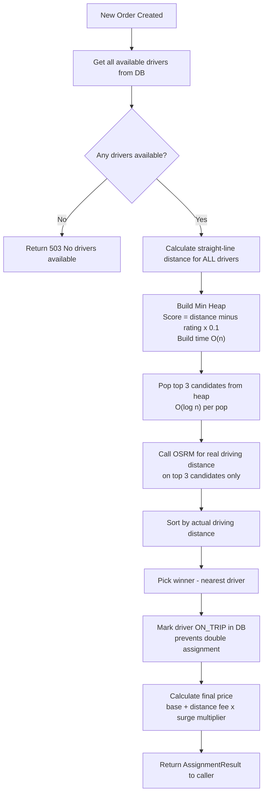
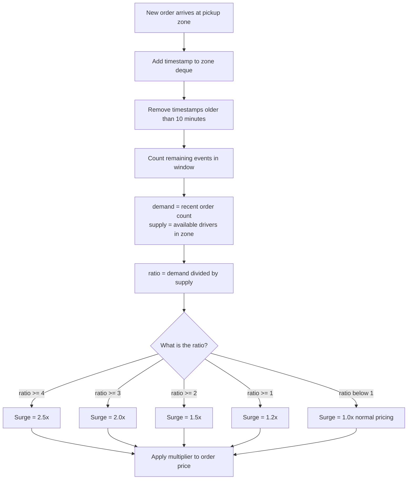
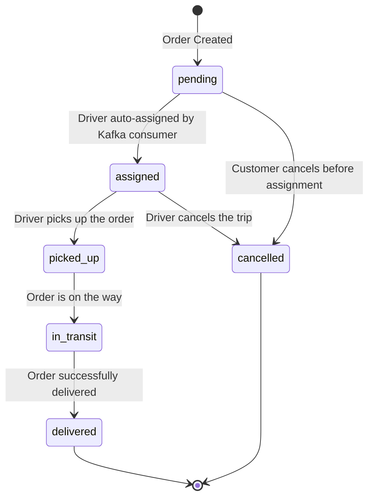
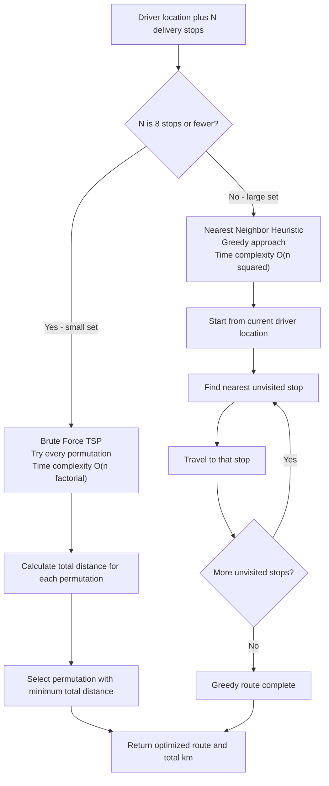
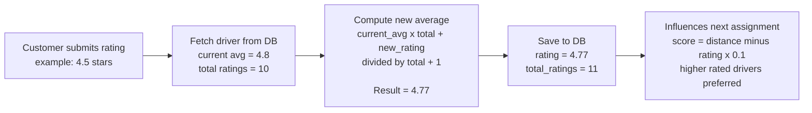
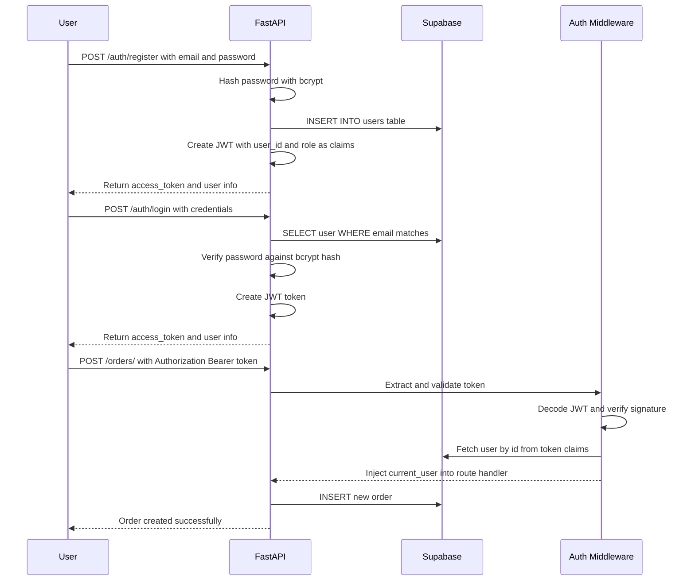
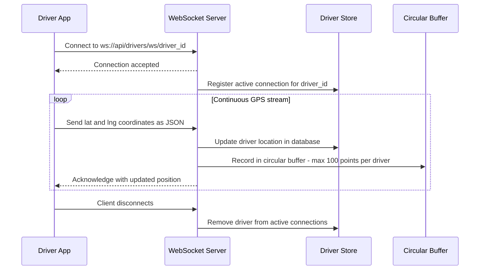
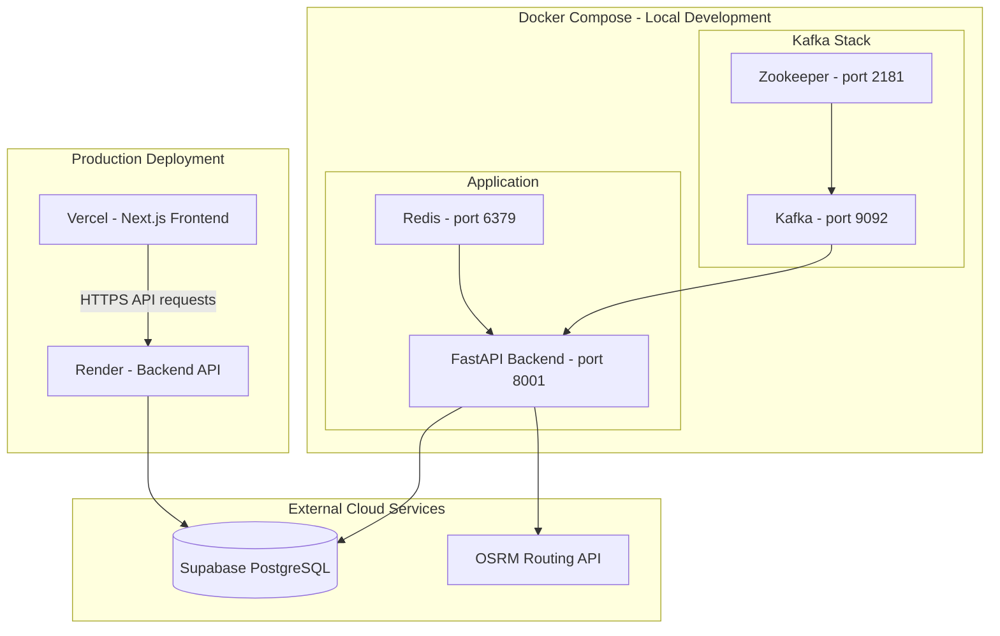

# Delivery Routing System

A production-grade delivery routing backend inspired by Swiggy/Zomato — built with FastAPI, Kafka, Supabase, and Next.js. Features real-time driver assignment, surge pricing, route optimization, and JWT authentication.

---

## Tech Stack

| Layer | Technology |
|-------|-----------|
| Backend | FastAPI (Python) |
| Message Queue | Apache Kafka |
| Database | Supabase (PostgreSQL) |
| ORM | SQLAlchemy |
| Routing | OSRM (Open Source Routing Machine) |
| Real-time | WebSockets |
| Auth | JWT (python-jose + bcrypt) |
| Frontend | Next.js + Tailwind CSS |
| Maps | Leaflet.js + OpenStreetMap |
| Containerization | Docker + Docker Compose |

---

## Project Structure

```
Martensite/
├── backend/
│   ├── consumers/
│   │   └── order_consumer.py       # Kafka consumer — auto-assigns drivers
│   ├── middleware/
│   │   └── auth_middleware.py      # JWT token validation
│   ├── models/
│   │   ├── driver.py               # SQLAlchemy ORM + Pydantic schemas
│   │   ├── order.py                # Order model with surge pricing
│   │   └── user.py                 # User model for auth
│   ├── routers/
│   │   ├── auth.py                 # /auth/register, /auth/login
│   │   ├── drivers.py              # Driver CRUD + assignment
│   │   ├── orders.py               # Order management
│   │   ├── ratings.py              # Driver rating system
│   │   └── routes.py               # Route optimization + surge
│   ├── services/
│   │   ├── assignment.py           # Min Heap driver assignment
│   │   ├── auth_service.py         # JWT creation + verification
│   │   ├── distance.py             # OSRM + Haversine distance
│   │   ├── driver_store.py         # DB queries for drivers
│   │   ├── kafka_producer.py       # Kafka event publishers
│   │   ├── location_history.py     # Circular buffer for GPS history
│   │   ├── order_service.py        # Order status state machine
│   │   ├── rating_service.py       # Running average ratings
│   │   ├── route_optimizer.py      # TSP route optimization
│   │   └── surge_service.py        # Sliding window surge pricing
│   ├── db.py
│   ├── init_db.py
│   ├── main.py
│   ├── Dockerfile
│   └── requirements.txt
├── frontend/
│   ├── app/
│   │   ├── page.tsx
│   │   ├── login/page.tsx
│   │   └── dashboard/page.tsx
│   ├── components/
│   │   ├── Map.tsx
│   │   ├── OrderBoard.tsx
│   │   ├── DriverList.tsx
│   │   └── SurgeIndicator.tsx
│   └── lib/
│       └── api.ts
└── docker-compose.yml
```

---

## System Architecture



---

## Order Lifecycle Flow



---

## Driver Assignment Algorithm



---

## Surge Pricing — Sliding Window



---

## Order State Machine — Directed Graph



---

## Route Optimization — TSP



---

## Driver Rating — Running Average



---

## JWT Authentication Flow



---

## WebSocket Real-Time Location



---

## Docker Architecture



---

## Data Structures Used

| Feature | Data Structure | Complexity |
|---------|---------------|------------|
| Driver Assignment | Min Heap | O(log n) nearest driver lookup |
| Order Status | Directed Graph | O(1) edge lookup for valid transitions |
| Surge Pricing | Sliding Window deque | O(1) add and remove |
| Location History | Circular Buffer deque maxlen | O(1) append, auto-evicts old data |
| Route Optimization | TSP and Nearest Neighbor | O(n!) brute force or O(n^2) heuristic |
| Rating System | Running Average | O(1) update without storing all ratings |
| Active WebSockets | Hash Map | O(1) driver lookup by ID |

---

## Getting Started

### Prerequisites
- Python 3.13+
- Node.js 18+
- Docker + Docker Compose
- Supabase account

### Backend Setup
```bash
cd backend
python -m venv venv
source venv/bin/activate
pip install -r requirements.txt

cp .env.example .env
# Fill in DATABASE_URL, SECRET_KEY, KAFKA_BOOTSTRAP_SERVERS

python init_db.py
uvicorn main:app --reload --port 8001
```

### Frontend Setup
```bash
cd frontend
npm install
cp .env.local.example .env.local
# Set NEXT_PUBLIC_API_URL=http://localhost:8001
npm run dev
```

### Docker Full Stack
```bash
docker-compose up --build
```

---

## API Reference

| Method | Endpoint | Auth Required | Description |
|--------|----------|--------------|-------------|
| POST | `/auth/register` | No | Register new user |
| POST | `/auth/login` | No | Login and get JWT token |
| POST | `/orders/` | Yes | Create a new order |
| GET | `/orders/` | Yes | List all orders |
| PATCH | `/orders/{id}/status` | Yes | Update order status |
| POST | `/drivers/register` | No | Register a driver |
| POST | `/drivers/assign` | No | Assign nearest available driver |
| GET | `/drivers/` | No | List all drivers |
| POST | `/ratings/` | No | Submit driver rating |
| GET | `/ratings/top-drivers` | No | Get top rated drivers |
| POST | `/routes/optimize` | No | Optimize multi-stop route |
| POST | `/routes/surge` | No | Get current surge multiplier |
| WS | `/drivers/ws/{id}` | No | Real-time GPS location stream |

Full interactive docs at `http://localhost:8001/docs`

---

## Deployment

| Service | Platform | Notes |
|---------|----------|-------|
| Backend API | Render | Free tier, auto-deploy from GitHub |
| Frontend | Vercel | One-click Next.js deployment |
| Database | Supabase | Managed PostgreSQL, free tier |

---

## Built By

Raj Aryan

Inspired by the engineering systems behind Swiggy, Zomato, and Uber Eats.